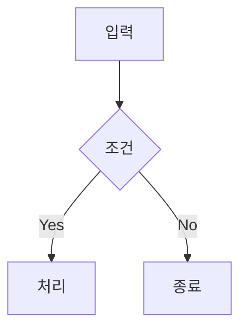

# nagusacos.github.io

수학, 기계학습 이론 학습용 시리즈 연재 블로그입니다.  
Jekyll 기반 [Just the Docs](https://just-the-docs.com) 테마를 커스터마이징하여 운영합니다.

---

## 목차

1. [빠른 시작](#빠른-시작)
2. [디렉토리 구조](#디렉토리-구조)
3. [새 글 작성하기](#새-글-작성하기)
4. [시리즈 연재 가이드](#시리즈-연재-가이드)
5. [마크다운 문법 레퍼런스](#마크다운-문법-레퍼런스)
6. [수식 작성 (KaTeX)](#수식-작성-katex)
7. [우측 참조 사이드바 (right_section)](#우측-참조-사이드바-right_section)
8. [커스텀 기능 모음](#커스텀-기능-모음)
9. [레이아웃 시스템](#레이아웃-시스템)
10. [네비게이션 구조](#네비게이션-구조)
11. [유틸리티 CSS 클래스](#유틸리티-css-클래스)
12. [사이트 설정 (_config.yml)](#사이트-설정-_configyml)
13. [배포](#배포)

---

## 빠른 시작

### 로컬 개발 환경

```bash
# 의존성 설치
bundle install

# 로컬 빌드 및 서버 실행
bundle exec jekyll serve

# 또는 빌드만
bundle exec jekyll build
```

빌드된 사이트는 `_site/` 디렉토리에 생성됩니다.

> **참고**: `_plugins/right_section.rb` 커스텀 플러그인 때문에 GitHub Pages 기본 빌드(safe mode)로는 동작하지 않습니다. 반드시 GitHub Actions 워크플로우(`deploy.yml`)를 통해 배포하세요.

---

## 디렉토리 구조

```
nagusacos.github.io/
├── _config.yml                  # 사이트 전체 설정
├── _includes/                   # 재사용 가능한 HTML 컴포넌트
│   ├── series_navigator.html    # 시리즈 내비게이터 위젯
│   ├── giscus.html              # Giscus 댓글 시스템
│   ├── newsletter.html          # 이메일 구독 폼
│   ├── head_custom.html         # KaTeX 수식 렌더링 스크립트
│   ├── x.html                   # X(Twitter) 임베드
│   ├── pixiv.html               # Pixiv 작품 임베드
│   ├── footer_custom.html       # 커스텀 푸터 콘텐츠
│   └── nav_footer_custom.html   # 사이드바 하단 카피라이트
├── _layouts/
│   ├── default.html             # 기본 레이아웃 (스크롤 바, 사이드바 토글 포함)
│   ├── post.html                # 연재 글 레이아웃 (시리즈+구독+댓글 자동 포함)
│   ├── minimal.html             # 사이드바 없는 최소 레이아웃
│   └── home.html                # 홈 페이지 레이아웃
├── _plugins/
│   └── right_section.rb         # 우측 참조 사이드바 Liquid 태그 플러그인
├── _sass/custom/
│   └── custom.scss              # 전체 커스텀 CSS (사이드바, 시리즈, 뉴스레터 등)
├── docs/                        # 블로그 콘텐츠 (모든 글은 이 안에)
│   ├── 미적분학/                 # 시리즈 폴더 예시
│   │   ├── index.md             # 시리즈 상위 페이지
│   │   ├── 미적1.md             # 제1편
│   │   ├── 미적2.md             # 제2편
│   │   └── ...
│   ├── series.md                # 시리즈 허브 (전체 연재 목록 자동 생성)
│   └── temp/                    # (참고용) 기존 테마 문서 보관
├── assets/                      # 정적 파일 (이미지, JS, CSS)
├── index.md                     # 사이트 홈 페이지
└── .github/workflows/
    └── deploy.yml               # GitHub Actions 배포 워크플로우
```

---

## 새 글 작성하기

### 기본 Front Matter

모든 글은 `docs/` 디렉토리 아래에 `.md` 파일로 작성합니다.

```yaml
---
layout: post           # 시리즈 내비게이터 + 구독 폼 + 댓글 자동 포함
title: "글 제목"
parent: "상위 페이지 제목"  # 사이드바 계층 구조용 (정확히 일치해야 함)
nav_order: 1              # 사이드바 내 정렬 순서 (숫자가 작을수록 위)
series: "시리즈 이름"      # 시리즈 내비게이터 연동
series_order: 1            # 시리즈 내 순서
---

여기에 본문을 작성합니다.
```

### 단독 글 (시리즈 아님)

```yaml
---
layout: default        # 기본 레이아웃 (시리즈 위젯/구독/댓글 미포함)
title: "글 제목"
nav_order: 3
---
```

### 선택적 Front Matter

| 키 | 타입 | 설명 |
|:---|:-----|:-----|
| `has_children` | bool | 하위 페이지가 있는 상위 페이지일 때 `true` |
| `has_toc` | bool | 하단 자식 페이지 목록 표시 여부 (기본: `true`) |
| `nav_exclude` | bool | 사이드바에서 숨기기 (URL 직접 접근은 가능) |
| `search_exclude` | bool | 검색 결과에서 제외 |
| `grand_parent` | string | 3단계 계층 시 조부모 페이지 제목 |
| `last_modified_date` | date | 페이지 하단 "최종 수정일" 표시 |
| `permalink` | string | 커스텀 URL 경로 |

---

## 시리즈 연재 가이드

시리즈 연재는 블로그의 핵심 기능입니다. 하나의 주제를 여러 편으로 나누어 작성할 때 사용합니다.

### 1단계: 시리즈 폴더 생성

`docs/` 아래에 시리즈 이름으로 폴더를 만듭니다.

```
docs/
└── Vol.5 백화요란 편
    ├── index.md        ← 시리즈 상위 페이지 (필수)
    ├── 1장 피어나길 바라는 꽃망울처럼.md    ← 제1편
    ├── 2장 홀로 꽃을 피우려는 너에게.md     ← 제2편
    ...
```

### 2단계: 상위 페이지 작성 (`index.md`)

```yaml
---
layout: default
title: "Vol.5 백화요란 편"
nav_order: 1
has_children: true
---

# Vol.5 백화요란 편

이곳에 간단한 시리즈 설명 작성...
```

### 3단계: 에피소드 작성

```yaml
---
layout: post
title: "1장 피어나길 바라는 꽃망울처럼"
parent: "Vol.5 백화요란 편"
nav_order: 1
series: "Vol.5 백화요란 편"
series_order: 1
---

# MDP와 가치 함수

이곳에 본문 내용 작성...
```

> **핵심 규칙**:
> - `parent` 값은 상위 페이지의 `title`과 **정확히 일치**해야 합니다.
> - `series` 값은 같은 시리즈의 모든 글에서 **동일한 문자열**이어야 합니다.
> - `layout: post`를 사용하면 시리즈 내비게이터, 뉴스레터 구독, Giscus 댓글이 **자동으로** 포함됩니다.

### 자동 기능

시리즈 글 작성 시 다음 기능이 자동으로 활성화됩니다:

| 기능 | 설명 |
|:-----|:-----|
| **시리즈 내비게이터** | 글 하단에 전체 에피소드 목록 + 현재 글 표시 |
| **시리즈 허브** | `docs/series.md` 페이지에 모든 시리즈가 카드 형태로 자동 수집 |
| **사이드바 계층** | 좌측 사이드바에서 드롭다운 메뉴로 묶임 |
| **뉴스레터 구독** | 시리즈 내비게이터 아래에 이메일 구독 폼 |
| **Giscus 댓글** | 페이지 최하단에 GitHub Discussions 기반 댓글 |

---

## 마크다운 문법 레퍼런스

### 기본 서식

```markdown
**굵은 글씨**
_기울임 글씨_
~~취소선~~
`인라인 코드`
```

### 제목 (Heading)

```markdown
# h1 제목
## h2 제목
### h3 제목
#### h4 제목
##### h5 제목
###### h6 제목
```

### 코드 블록

````markdown
```python
def hello():
    print("Hello, World!")
```
````

코드 블록에는 **복사 버튼**이 자동으로 표시됩니다 (`enable_copy_code_button: true`).

### Mermaid 다이어그램

````markdown

````

### 콜아웃 (Callout / 알림 상자)

```markdown
{: .note }
> 참고할 내용입니다.

{: .warning }
> 주의가 필요한 내용입니다.

{: .important }
> 중요한 내용입니다.

{: .highlight }
> 강조할 내용입니다.

{: .new }
> 새로운 기능/변경사항입니다.
```

#### 커스텀 제목 콜아웃

```markdown
{: .note-title }
> 내가 정한 제목
>
> 콜아웃 본문 내용입니다.
```

#### 다중 문단 콜아웃

```markdown
{: .important }
> 첫 번째 문단입니다.
>
> 두 번째 문단입니다.
```

### 라벨 (Label / 뱃지)

```markdown
기본 라벨
{: .label }

Blue 라벨
{: .label .label-blue }

Green 라벨 (Stable 등)
{: .label .label-green }

Purple 라벨
{: .label .label-purple }

Yellow 라벨
{: .label .label-yellow }

Red 라벨 (Deprecated 등)
{: .label .label-red }
```

#### 제목 옆 라벨

```markdown
## 새 기능
{: .d-inline-block }

v2.0
{: .label .label-green }
```

### 버튼 (Button)

```markdown
[기본 버튼](URL){: .btn }
[Primary 버튼](URL){: .btn .btn-primary }
[Purple 버튼](URL){: .btn .btn-purple }
[Blue 버튼](URL){: .btn .btn-blue }
[Green 버튼](URL){: .btn .btn-green }
[Outline 버튼](URL){: .btn .btn-outline }
```

버튼 간격:
```markdown
[버튼 1](URL){: .btn .btn-purple .mr-2 }
[버튼 2](URL){: .btn .btn-blue }
```

### 표 (Table)

```markdown
| 항목 | 설명 | 비고 |
|:-----|:----:|-----:|
| 왼쪽 정렬 | 가운데 정렬 | 오른쪽 정렬 |
```

표는 자동으로 반응형 스크롤이 적용됩니다.

### 페이지 내 목차 (Table of Contents)

```markdown
## Table of contents
{: .no_toc .text-delta }

1. TOC
{:toc}
```

- `{:toc}`는 페이지당 **한 번만** 사용 가능합니다.
- 목차에서 제외하려면 제목에 `{: .no_toc }` 를 붙입니다.

#### 접을 수 있는 목차

```markdown
<details open markdown="block">
  <summary>목차</summary>
  {: .text-delta }
1. TOC
{:toc}
</details>
```

### 접기/펼치기 (Collapsible Section)

```markdown
<details markdown="block">
<summary>클릭하여 펼치기</summary>

여기에 **마크다운** 본문을 작성합니다.

- 리스트도 사용 가능
- `코드`도 사용 가능

</details>
```

### 각주 (Footnote)

```markdown
본문에 각주 표시[^1].

[^1]: 각주 내용입니다.
```

### 작업 목록 (Task List)

```markdown
- [ ] 미완료 항목
- [x] 완료 항목
```

### 렌더링 예시 + 코드 블록 패턴

```html
<div class="code-example" markdown="1">
[렌더링된 버튼](URL){: .btn .btn-primary }
</div>
```
뒤이어 코드 블록을 작성하면 "렌더링 결과 + 코드"가 함께 표시됩니다.

---

## 수식 작성 (KaTeX)

본 블로그는 [KaTeX](https://katex.org/) v0.16.9을 사용하여 LaTeX 수식을 렌더링합니다.

### 인라인 수식

```markdown
아인슈타인의 질량-에너지 등가식은 $E = mc^2$ 입니다.
```

또는:
```markdown
\(E = mc^2\)
```

### 블록(Display) 수식

```markdown
$$
\int_0^\infty e^{-x^2} \, dx = \frac{\sqrt{\pi}}{2}
$$
```

또는:
```markdown
\[
\sum_{n=1}^{\infty} \frac{1}{n^2} = \frac{\pi^2}{6}
\]
```

### 자주 쓰는 수식 예시

| 용도 | 작성법 |
|:-----|:-------|
| 분수 | `$\frac{a}{b}$` |
| 적분 | `$\int_a^b f(x)\,dx$` |
| 급수 | `$\sum_{n=0}^N a_n$` |
| 행렬 | `$\begin{bmatrix} a & b \\ c & d \end{bmatrix}$` |
| 그리스 문자 | `$\alpha, \beta, \gamma, \theta$` |
| 편미분 | `$\frac{\partial f}{\partial x}$` |
| 극한 | `$\lim_{x \to 0} \frac{\sin x}{x} = 1$` |
| 벡터 | `$\vec{v} = \mathbf{v}$` |

> **참고**: `_config.yml`에는 `math_engine: mathjax`로 설정되어 있지만, 실제 렌더링은 `_includes/head_custom.html`에서 KaTeX가 처리합니다. Kramdown이 생성하는 `<script type="math/tex">` 태그를 KaTeX가 변환하는 방식입니다.

---

## 우측 참조 사이드바 (right_section)

본문 옆에 이미지, 수식, 참고 자료 등을 나란히 표시할 수 있는 커스텀 Liquid 태그입니다.

### 기본 사용법

```markdown

여기에 **마크다운** 본문을 자유롭게 작성합니다.
- 리스트, [링크](url), `코드`, $수식$ 모두 정상 렌더링됩니다.
+++


```

- `+++` 구분자를 기준으로 **좌측(본문)** 과 **우측(참조)** 콘텐츠를 나눕니다.
- 우측에 이미지, 수식 블록, 표 등 어떤 마크다운이든 넣을 수 있습니다.
- 상대 경로 이미지는 `site.baseurl`이 자동으로 앞에 붙습니다.

### 여러 섹션 사용

한 페이지에 여러 번 사용 가능하며, 각 섹션에 `id="section-1"`, `id="section-2"` ... 가 자동 부여됩니다.

```markdown

첫 번째 섹션 본문...
+++




두 번째 섹션 본문...
+++
$$E = mc^2$$

```

### 이미지 경로 단축

`site.imageurl` 전역 변수를 사용할 수 있습니다:
```markdown

```
이는 `{{ site.baseurl }}/assets/images/graph.png`으로 변환됩니다.

### 반응형 동작

| 화면 크기 | 동작 |
|:----------|:-----|
| 데스크톱 (넓은 화면) | 본문 옆에 우측 패널이 나란히 표시, `position: sticky`로 스크롤 추적 |
| 작은 화면 (임계값 이하) | 우측 패널이 슬라이드 오버레이로 변환, 토글 버튼으로 열기/닫기 |

### 설정

`_config.yml`에서 우측 사이드바 크기를 조절할 수 있습니다:

```yaml
right_sidebar_width: 500px             # 우측 패널 너비
right_sidebar_collapse_width: 500px    # 패널 접힘 임계값
right_sidebar_peek_width: 10px         # 접혔을 때 살짝 보이는 너비
```

---

## 커스텀 기능 모음

### 1. 스크롤 진행 바 (Scroll Progress Bar)

페이지 최상단에 파란색 그라데이션 바가 스크롤 진행률을 표시합니다.

- **자동 활성화**: `default` 레이아웃을 사용하는 모든 페이지에 자동 적용
- **설정 불필요**: 별도 Front Matter나 설정 없이 동작
- **스타일**: `#3258A6` → `#82A8D9` 그라데이션, 높이 4px

### 2. 시리즈 내비게이터 (Series Navigator)

연재 글 하단에 전체 에피소드 목록을 카드 형태로 표시합니다.

- **활성화 조건**: `layout: post` + `series` Front Matter 설정 시 자동 표시
- **기능**: 현재 글 하이라이트, 에피소드 번호 표시
- **구현 파일**: `_includes/series_navigator.html`

### 3. 시리즈 허브 페이지 (Series Hub)

`docs/series.md`에서 모든 시리즈를 자동으로 수집하여 카드 그리드로 표시합니다.

- 별도 설정 없이 `series` Front Matter가 있는 모든 글을 자동 감지
- 시리즈별 카드에 에피소드 수와 목록이 표시됨

### 4. Giscus 댓글 시스템

GitHub Discussions 기반의 댓글 시스템입니다.

- **활성화 조건**: `layout: post` 사용 시 자동 포함
- **구현 파일**: `_includes/giscus.html`
- **설정 (`_config.yml`)**:

```yaml
giscus:
  repo: "nagusacos/nagusacos.github.io"
  repo_id: "실제_Repository_ID"        # giscus.app에서 발급
  category: "Announcements"
  category_id: "실제_Category_ID"       # giscus.app에서 발급
  mapping: "pathname"
  strict: "0"
  reactions_enabled: "1"
  emit_metadata: "0"
  input_position: "bottom"
  theme: "light"
  lang: "ko"
```

> **초기 설정 필요**: [giscus.app](https://giscus.app)에서 `repo_id`와 `category_id`를 발급받아 `_config.yml`에 입력해야 합니다. 리포지토리에 GitHub Discussions가 활성화되어 있어야 합니다.

### 5. 뉴스레터 이메일 구독

Buttondown 서비스를 통한 이메일 구독 폼입니다.

- **활성화 조건**: `layout: post` 사용 시 자동 포함
- **구현 파일**: `_includes/newsletter.html`
- **설정 (`_config.yml`)**:

```yaml
newsletter:
  endpoint: "https://buttondown.email/api/emails/embed-subscribe/nagusacos"
```

### 6. 코드 복사 버튼 (Copy to Clipboard)

모든 코드 블록에 복사 버튼이 자동으로 표시됩니다.

- **설정**: `_config.yml`에서 `enable_copy_code_button: true`
- 클릭 시 코드가 클립보드에 복사되고, 버튼이 잠시 "Copied!" 상태로 변경됨

### 7. X(Twitter) 포스트 임베드

```markdown

```

다크 테마로 트윗을 가운데 정렬하여 임베드합니다.

### 8. Pixiv 포스트 임베드

```markdown


```

Pixiv 일러스트 및 만화 작품을 반응형 카드 형태로 임베드합니다. 작품 ID를 직접 입력하거나 전체 작품 URL을 입력할 수 있으며, 하단에 원본 Pixiv 링크로 이동할 수 있는 대체 텍스트가 함께 생성됩니다.

### 9. 좌측 사이드바 오버레이 토글

기본 Just the Docs 사이드바를 오버레이 팝업 방식으로 변경하였습니다.

- **◀ / ▶ 버튼**으로 사이드바를 열고 닫을 수 있음
- 사이드바가 본문을 밀어내지 않고 위에 겹쳐서 표시됨
- CSS Checkbox Hack으로 구현 (JavaScript 미사용)

---

## 레이아웃 시스템

| 레이아웃 | 용도 | 포함 기능 |
|:---------|:-----|:----------|
| `default` | 일반 페이지 | 사이드바, 검색, 스크롤 바, 브레드크럼 |
| `post` | 연재 글 | default + 시리즈 내비게이터 + 뉴스레터 + 댓글 |
| `minimal` | 사이드바 없는 페이지 | 브레드크럼만 포함 |
| `home` | 홈 페이지 | default 상속 |

### 레이아웃별 자동 포함 컴포넌트

```
post 레이아웃 = default 레이아웃 + 아래 3개:
  1.   ← 시리즈 내비게이터
  2.         ← 뉴스레터 구독 폼
  3.             ← Giscus 댓글
```

---

## 네비게이션 구조

### 페이지 계층 (최대 3단계)

```yaml
# 1단계 (최상위)
---
title: 수학
nav_order: 1
has_children: true
---

# 2단계 (자식)
---
title: 미적분학
parent: 수학
nav_order: 1
has_children: true
---

# 3단계 (손자)
---
title: 극한의 정의
parent: 미적분학
grand_parent: 수학
nav_order: 1
---
```

### 정렬 순서 (`nav_order`)

- 숫자가 작을수록 위에 표시됩니다.
- 숫자가 없는 페이지는 알파벳 순으로 정렬된 후 숫자가 있는 페이지 뒤에 표시됩니다.
- 소수점도 사용 가능합니다 (`nav_order: 1.5`).

### 사이드바에서 숨기기

```yaml
nav_exclude: true     # 사이드바에서 숨김 (URL 접근은 가능)
search_exclude: true  # 검색 결과에서도 제외
```

### 자식 페이지 접기/펼치기

```yaml
nav_fold: true  # 사이드바에서 기본적으로 접힌 상태로 표시
```

### 외부 링크

`_config.yml`에서 설정:
```yaml
nav_external_links:
  - title: "nagusacos on GitHub"
    url: https://github.com/nagusacos
    hide_icon: false
    opens_in_new_tab: true
```

---

## 유틸리티 CSS 클래스

Kramdown의 IAL(Inline Attribute List) 문법 `{: .클래스명 }` 을 사용하여 마크다운 요소에 CSS 클래스를 적용할 수 있습니다.

### 폰트 크기

```markdown
작은 텍스트
{: .fs-2 }

큰 텍스트
{: .fs-8 }
```

| 클래스 | 소형 화면 | 대형 화면 |
|:-------|:----------|:----------|
| `.fs-1` | 9px | 10px |
| `.fs-2` | 11px | 12px |
| `.fs-3` | 12px | 14px |
| `.fs-4` | 14px | 16px |
| `.fs-5` | 16px | 18px |
| `.fs-6` | 18px | 24px |
| `.fs-7` | 24px | 32px |
| `.fs-8` | 32px | 38px |
| `.fs-9` | 38px | 42px |
| `.fs-10` | 42px | 48px |

### 폰트 두께

`.fw-300` (Light), `.fw-400` (Normal), `.fw-500` (Medium), `.fw-700` (Bold)

### 텍스트 스타일

| 클래스 | 효과 |
|:-------|:-----|
| `.text-left` | 왼쪽 정렬 |
| `.text-center` | 가운데 정렬 |
| `.text-right` | 오른쪽 정렬 |
| `.text-uppercase` | 대문자 변환 |
| `.text-capitalize` | 첫 글자 대문자 |
| `.text-mono` | 모노스페이스 폰트 |
| `.text-small` | 작은 텍스트 |
| `.text-delta` | 작고 대문자인 서브헤딩 스타일 |
| `.no-wrap` | 줄바꿈 방지 |

### 표시 (Display)

| 클래스 | 효과 |
|:-------|:-----|
| `.d-block` | 블록 요소 |
| `.d-inline` | 인라인 요소 |
| `.d-inline-block` | 인라인 블록 |
| `.d-flex` | Flexbox 컨테이너 |
| `.d-none` | 숨김 |

반응형 변형: `.d-sm-block`, `.d-md-block`, `.d-lg-block`, `.d-xl-block`

### 여백 (Margin & Padding)

- **접두사**: `m` (margin), `p` (padding)
- **방향**: `t` (top), `r` (right), `b` (bottom), `l` (left), `x` (좌우), `y` (상하)
- **크기**: `0`~`8`, `auto`

```markdown
넉넉한 아래 여백
{: .mb-6 }

가운데 정렬
{: .mx-auto }
```

### 색상

```markdown
파란 텍스트
{: .text-blue-200 }

보라 배경
{: .bg-purple-000 }
```

색상 패밀리: `grey-lt`, `grey-dk`, `purple`, `blue`, `green`, `yellow`, `red`  
각 패밀리마다 `000` ~ `300` 단계가 있습니다.

### Flexbox 유틸리티

`.flex-justify-start`, `.flex-justify-end`, `.flex-justify-between`, `.flex-justify-around`  
`.flex-auto`, `.flex-wrap`  
`.v-align-baseline`, `.v-align-bottom`, `.v-align-middle`, `.v-align-text-top`

---

## 사이트 설정 (_config.yml)

### 주요 설정 항목

| 설정 | 현재 값 | 설명 |
|:-----|:--------|:-----|
| `title` | `nagusacos` | 사이트 제목 (검색창 플레이스홀더, 브라우저 탭에 표시) |
| `description` | 수학, 기계학습 이론 학습용... | SEO 메타 태그용 사이트 설명 |
| `url` | `https://nagusacos.github.io` | 사이트 도메인 |
| `repository` | `nagusacos/nagusacos.github.io` | GitHub 메타데이터 연동 |
| `search_enabled` | `true` | 검색 기능 활성화 |
| `enable_copy_code_button` | `true` | 코드 복사 버튼 |
| `heading_anchors` | `true` | 제목 앵커 링크 |
| `back_to_top` | `true` | "Back to top" 링크 |
| `color_scheme` | `nil` (light) | 색상 테마 |
| `nav_sort` | `case_sensitive` | 네비게이션 정렬 방식 |

### 검색 설정

```yaml
search:
  heading_level: 2         # 페이지를 섹션으로 분할하는 제목 레벨
  previews: 2              # 검색 결과당 미리보기 수
  preview_words_before: 3  # 매칭 단어 앞 표시 단어 수
  preview_words_after: 3   # 매칭 단어 뒤 표시 단어 수
  rel_url: true            # 검색 결과에 상대 URL 표시
  button: false            # 플로팅 검색 버튼
  focus_shortcut_key: "k"  # Ctrl+K / Cmd+K 로 검색창 포커스
```

### 콜아웃 색상 설정

```yaml
callouts:
  highlight:
    color: yellow
  important:
    title: Important
    color: blue
  new:
    title: New
    color: green
  note:
    title: Note
    color: purple
  warning:
    title: Warning
    color: red
```

---

## 배포

### GitHub Actions (권장)

`.github/workflows/deploy.yml` 워크플로우가 `bundle exec jekyll build` 명령으로 사이트를 빌드하고 GitHub Pages에 배포합니다.

**커스텀 플러그인(`_plugins/right_section.rb`)을 사용하므로 반드시 GitHub Actions를 통해 배포해야 합니다.** 기본 GitHub Pages 빌드(safe mode)에서는 커스텀 플러그인이 실행되지 않습니다.

### 수동 빌드

```bash
bundle exec jekyll build
# _site/ 디렉토리에 빌드 결과물 생성
```

---

## 색상 팔레트

본 블로그에 사용되는 주요 색상입니다.

| 용도 | 색상 코드 | 설명 |
|:-----|:----------|:-----|
| Primary | `#3258A6` | 링크, 뱃지, 액센트 |
| Secondary | `#2E4186` | 호버 상태, 강조 |
| Dark | `#0F1B40` | 네이비 다크 배경 |
| Background | `#F2F2F2` | 연한 회색 배경 |
| Accent Light | `#82A8D9` | 그라데이션, 하이라이트 |

---

## 커스텀 파일 인벤토리

본 블로그에서 기본 Just the Docs 테마에 추가/수정된 파일 목록입니다.

| 파일 경로 | 역할 |
|:----------|:-----|
| `_includes/series_navigator.html` | 시리즈 내비게이터 위젯 |
| `_includes/giscus.html` | Giscus 댓글 시스템 |
| `_includes/newsletter.html` | 뉴스레터 이메일 구독 |
| `_includes/head_custom.html` | KaTeX 수식 렌더링 |
| `_includes/x.html` | X(Twitter) 포스트 임베드 |
| `_includes/pixiv.html` | Pixiv 포스트 임베드 |
| `_includes/footer_custom.html` | 커스텀 푸터 콘텐츠 |
| `_includes/nav_footer_custom.html` | 사이드바 하단 카피라이트 |
| `_includes/search_placeholder_custom.html` | 검색창 플레이스홀더 |
| `_layouts/post.html` | 연재 글 레이아웃 |
| `_layouts/default.html` | 기본 레이아웃 (오버레이 사이드바 + 스크롤 바) |
| `_plugins/right_section.rb` | 우측 참조 사이드바 Liquid 태그 |
| `_sass/custom/custom.scss` | 전체 커스텀 CSS (763줄) |
| `docs/series.md` | 시리즈 허브 페이지 |
| `.github/workflows/deploy.yml` | GitHub Actions 배포 워크플로우 |

---

Copyright © 2026 nagusacos. All rights reserved.
